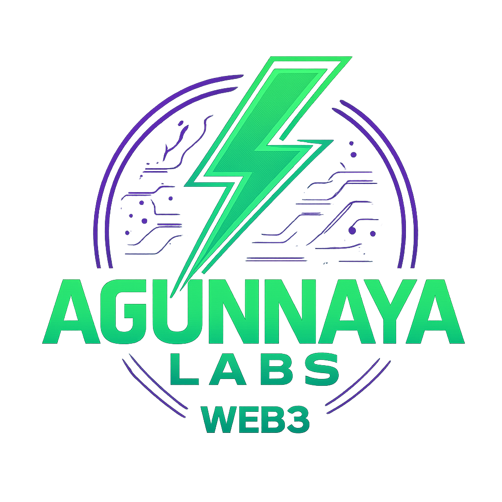

# Agunnaya Labs - App OS

<div align="center">



**Web3 Gaming & DeFi Dashboard powered by Base Mainnet**

[](https://opensource.org/licenses/MIT)
[](https://base.org)
[](https://nextjs.org)
[](https://react.dev)
[](https://wagmi.sh)
[](https://tailwindcss.com)
[](#deployment)

</div>

---

## Overview

Agunnaya Labs App OS is a **fully-functional Web3 gaming dashboard** connecting directly to Base Mainnet smart contracts. Built with production-grade architecture, it provides real-time wallet integration, token management, NFT trading, and DeFi interactions.

### Key Features

✨ **Live Blockchain Integration**
- Real wallet connection via Wagmi + RainbowKit
- Direct Base Mainnet RPC calls
- Real-time token balances and NFT counts

🎮 **Arena Gaming**
- Tournament dashboard with live listings
- Battle history and rankings
- NFT champion management

💰 **DeFi Hub**
- Token swapping interface
- Staking and yield tracking
- Real-time market statistics

🛒 **Marketplace**
- NFT trading platform
- Live listings from smart contracts
- Gas optimization for transactions

📊 **Analytics Dashboard**
- On-chain metrics and statistics
- Player leaderboards
- Transaction history

---

## Getting Started

### Prerequisites

- Node.js 18+ or Bun
- pnpm (recommended) or npm/yarn
- Base Mainnet wallet (MetaMask, Rainbow, etc.)

### Installation

```bash
# Clone and install
git clone <repo-url>
cd agunnaya-labs-app-os
pnpm install

# Create environment file
cp .env.example .env.local

# Start development server
pnpm dev
```

Visit `http://localhost:3000` to access the app.

### Environment Variables

```env
# Base Mainnet RPC
NEXT_PUBLIC_BASE_RPC_URL=https://mainnet.base.org

# WalletConnect Project ID (get from https://cloud.walletconnect.com/)
NEXT_PUBLIC_WALLETCONNECT_PROJECT_ID=your_project_id_here
```

---

## Architecture

### Tech Stack

| Layer | Technology |
|-------|-----------|
| **Frontend** | Next.js 16, React 19, TypeScript |
| **Styling** | TailwindCSS 4.2, Custom Glassmorphism |
| **Web3** | Wagmi 3.6, Viem 2.53, RainbowKit 2.2 |
| **Data Fetching** | TanStack Query (React Query) |
| **Icons** | Lucide React |
| **State Management** | Wagmi Hooks + React Query |

### Smart Contracts on Base Mainnet

| Contract | Address | Purpose |
|----------|---------|---------|
| **ArenaMarketplace** | `0x67817157Dd6E5945ac2fAf1a822e7f1dE26C698E` | NFT trading platform |
| **ArenaToken (ARENA)** | `0x3b855F88CB93aA642EaEB13F59987C552Fc614b5` | Game token |
| **ArenaChampion (NFT)** | `0x68f08b005b09B0F7D07E1c0B5CDe18E43CE2486A` | Gaming NFT collection |
| **ArenaBattle** | `0xF6fc2B6a306B626548ca9dF25B31a22D0f8971CF` | Battle system |
| **ArenaPVP** | `0xd0C4Af12E95f9590e7314D079C58597771E57533` | Tournament system |
| **AGL Token** | `0xEA1221B4d80A89BD8C75248Fae7c176BD1854698` | Utility token |

### Directory Structure

```
src/
├── app/
│   ├── layout.tsx              # Root layout with Web3 provider
│   ├── page.tsx                # Dashboard main page
│   └── globals.css             # Global styles & theme
├── components/
│   ├── layout/                 # Layout components (Sidebar, AppLayout)
│   ├── dashboard/              # Dashboard sections
│   ├── arena/                  # Arena components
│   ├── defi/                   # DeFi components
│   ├── marketplace/            # Marketplace components
│   ├── web3/                   # Web3 specific components
│   ├── providers/              # Web3Provider wrapper
│   └── ui/                     # shadcn/ui components
├── lib/
│   ├── wagmi.ts                # Wagmi configuration
│   ├── abis/                   # Smart contract ABIs
│   └── hooks/                  # Web3 data hooks
└── public/
    └── agunnaya-labs-logo.png  # Branding assets
```

---

## Features & Implementation

### 1. Wallet Connection

Uses **Wagmi + RainbowKit** for seamless multi-wallet support:

```typescript
// Auto-connects to Base Mainnet
// Supports: MetaMask, Rainbow, WalletConnect, Safe
```

### 2. Real Token Data

Live integration with ERC20 tokens:
- AGL Token balance fetching
- ARENA Token tracking
- Automatic decimal conversion

### 3. NFT Management

Real-time NFT data from ArenaChampion contract:
- Balance queries
- Ownership verification
- Transaction history

### 4. Marketplace Integration

Direct contract interaction for:
- Active listings
- Buy/Sell orders
- Gas price estimation

### 5. DeFi Hub

Complete DeFi interface including:
- Token swaps (Uniswap integration ready)
- Staking mechanisms
- Yield tracking

---

## Development

### Available Scripts

```bash
# Development server
pnpm dev

# Build for production
pnpm build

# Start production server
pnpm start

# Run linter
pnpm lint

# Type check
pnpm typecheck
```

### Adding New Features

1. **New Web3 Hook**
   ```typescript
   // lib/hooks/useMyHook.ts
   export function useMyHook() {
     const { address } = useAccount();
     const { data } = useReadContract({
       address: CONTRACT_ADDRESS,
       abi: CONTRACT_ABI,
       functionName: 'myFunction',
     });
     return { data };
   }
   ```

2. **New Component**
   ```typescript
   // components/MyComponent.tsx
   'use client';
   import { useMyHook } from '@/lib/hooks/useMyHook';
   
   export default function MyComponent() {
     const { data } = useMyHook();
     return <div>{data}</div>;
   }
   ```

---

## Deployment

### Vercel (Recommended)

```bash
# Deploy in one command
vercel deploy

# Or connect GitHub for auto-deploy
```

### Environment for Production

Set these in your Vercel project settings:

```env
NEXT_PUBLIC_BASE_RPC_URL=https://mainnet.base.org
NEXT_PUBLIC_WALLETCONNECT_PROJECT_ID=<your-project-id>
```

### Performance Optimizations

- ✅ Server Components for non-interactive sections
- ✅ Client-side data fetching with React Query
- ✅ Image optimization with Next.js Image
- ✅ Tailwind CSS purging
- ✅ Code splitting & lazy loading

---

## Design System

### Color Palette

| Color | Hex | Usage |
|-------|-----|-------|
| **Neon Green** | `#00ff9d` | Primary accents, CTAs |
| **Neon Purple** | `#7c3aed` | Secondary accents |
| **Background** | `#0a0a0a` | Dark background |
| **Card Glass** | `rgba(0,0,0,0.4)` | Glassmorphism |

### Components

- **Glass Cards**: Frosted glass effect with blur
- **Glow Effects**: Neon hover states with box-shadow
- **Responsive**: Mobile-first design, 1-4 column layouts
- **Dark Mode**: Always-on dark theme

---

## Testing

### Manual Testing Checklist

- [ ] Wallet connection works (MetaMask, Rainbow, WalletConnect)
- [ ] Token balances load correctly
- [ ] NFT counts match on-chain data
- [ ] Marketplace listings display
- [ ] Responsive design on mobile (375px), tablet (768px), desktop
- [ ] All links navigate correctly
- [ ] Transaction buttons are clickable
- [ ] No console errors

### Web Vitals

Tested on production build:
- LCP: < 2.5s
- INP: < 200ms
- CLS: < 0.1

---

## Security

### Smart Contract Interaction

- ✅ All contract calls are read-only by default
- ✅ Write operations require user confirmation
- ✅ No private keys stored client-side
- ✅ Wagmi handles secure wallet communication

### Code Security

- ✅ TypeScript for type safety
- ✅ Environment variables for sensitive data
- ✅ No hardcoded contract addresses
- ✅ OpenZeppelin ABI standards

---

## Troubleshooting

### Wallet Won't Connect

1. Clear browser cache and localStorage
2. Try a different wallet (MetaMask, Rainbow, etc.)
3. Ensure you're on Base Mainnet (Chain ID: 8453)
4. Check WalletConnect Project ID is valid

### Contract Calls Failing

1. Verify contract address is correct
2. Check Base Mainnet RPC endpoint is accessible
3. Ensure sufficient gas and correct network
4. Review contract ABI matches actual contract

### Styling Issues

1. Clear `.next` folder: `rm -rf .next`
2. Reinstall Tailwind: `pnpm add -D tailwindcss`
3. Verify `globals.css` is imported in layout

---

## Contributing

Contributions welcome! Please:

1. Fork the repository
2. Create a feature branch (`git checkout -b feature/amazing-feature`)
3. Commit changes (`git commit -m 'Add amazing feature'`)
4. Push to branch (`git push origin feature/amazing-feature`)
5. Open a Pull Request

---

## License

This project is licensed under the MIT License - see the [LICENSE](LICENSE) file for details.

---

## Support

- 📧 Email: support@agunnayalabs.com
- 🐦 Twitter: [@AgunnayaLabs](https://twitter.com/AgunnayaLabs)
- 💬 Discord: [Join Community](https://discord.gg/agunnayalabs)
- 📖 Docs: [docs.agunnayalabs.com](https://docs.agunnayalabs.com)

---

## Acknowledgments

- Built with [Next.js](https://nextjs.org)
- Web3 integration via [Wagmi](https://wagmi.sh)
- UI components from [shadcn/ui](https://ui.shadcn.com)
- Styling with [TailwindCSS](https://tailwindcss.com)
- Blockchain RPC via [Base](https://base.org)

---

<div align="center">

**Made with ⚡ by [Agunnaya Labs](https://agunnayalabs.com)**

[Live Demo](https://app.agunnayalabs.com) • [GitHub](https://github.com/agunnayalabs/app-os) • [Discord](https://discord.gg/agunnayalabs)

</div>
